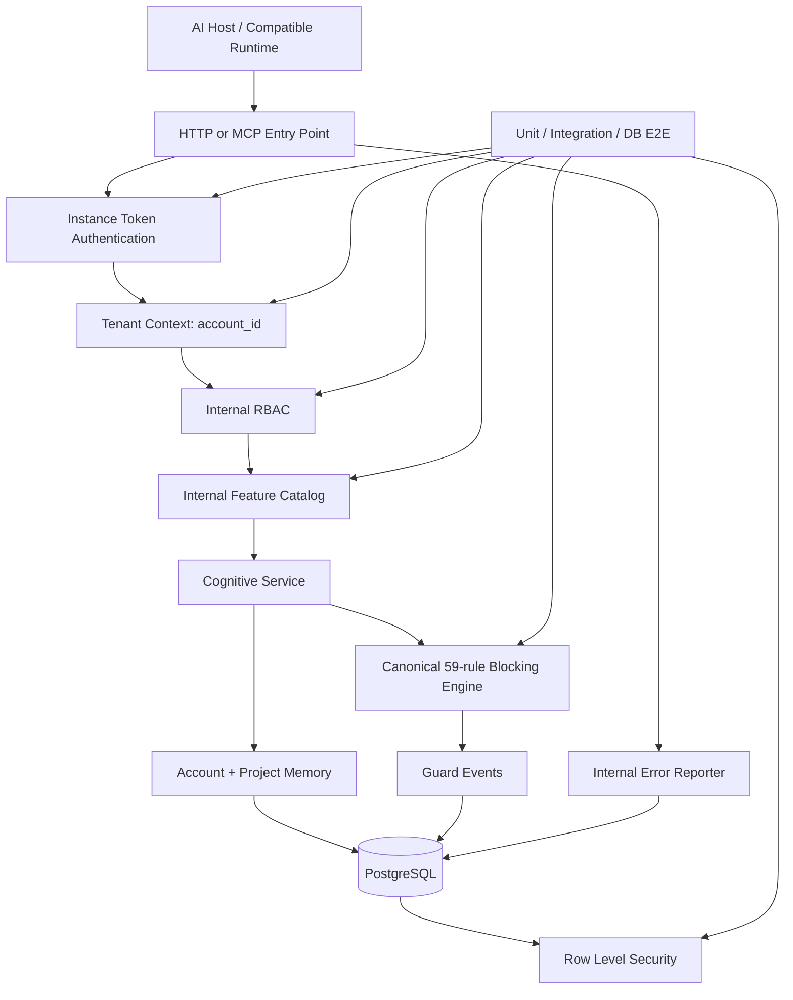
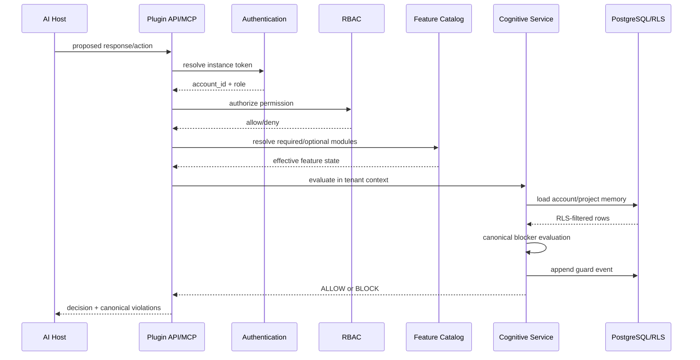

# System Map — Cognitive Blocker Plugin

## Dependency order

1. PRD / canonical contract
2. System boundaries and module map
3. Tenant identity and account isolation
4. RBAC permission decision
5. PostgreSQL RLS enforcement
6. Feature catalog and feature flags
7. Internal error reporting
8. Automated tests across every layer

This order is intentional: later controls depend on identity and authorization established earlier.

## Component map

## Request sequence

## Boundary rule

The model never decides whether its own bypass is acceptable. The deterministic plugin control path makes that decision using canonical rules, tenant state and evidence.
